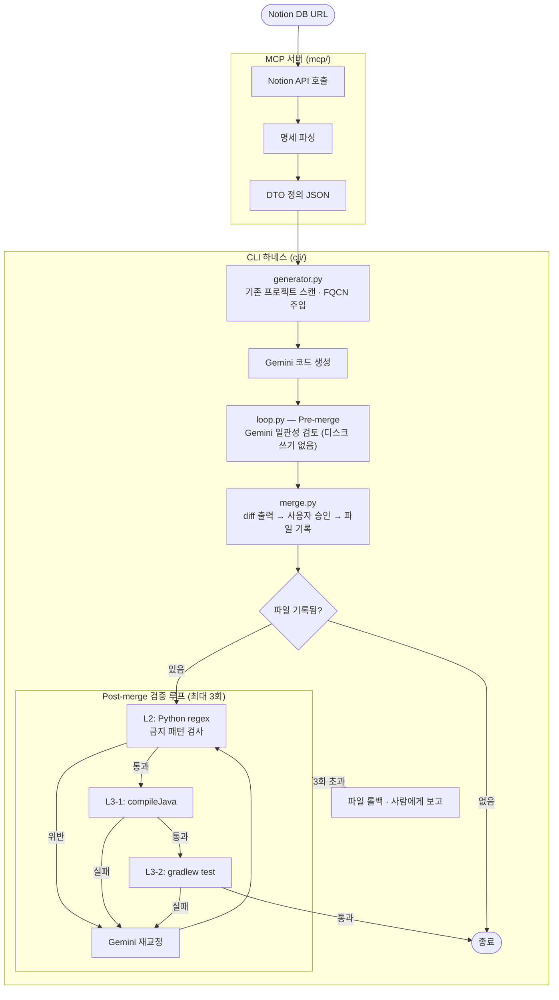

# Notion Spec-to-Code

Notion에 API 명세를 작성하면 Gemini가 Spring Boot 코드를 자동 생성하고, 생성된 코드가 규칙을 어기거나 빌드에 실패하면 스스로 교정하는 시스템.

> **핵심 원칙:** "말로 지시하지 말고 시스템이 막게 한다."

---

## 왜 만들었나

팀에서 Notion으로 API 명세를 관리하는데 DTO·Controller·Service 뼈대를 매번 손으로 작성하는 게 반복 작업이었다. AI로 자동 생성하면 되지만, 프롬프트에 규칙을 아무리 적어도 AI가 자꾸 어겼다.

- `ServiceImpl` 클래스 생성
- 잘못된 import 경로
- `@Entity` 파일 생성
- `*Tests.java`가 `src/main/java`에 들어가는 문제

이 프로젝트의 핵심 질문: **"AI가 규칙을 따르도록 강제하려면 어떻게 시스템을 설계해야 하는가?"**

---

## 전체 파이프라인



---

## 제약 강제 전략 — 4개 레이어

하나가 뚫려도 다음 레이어가 잡는다.

| 레이어 | 위치 | 방식 | 강제력 |
|--------|------|------|--------|
| L1 | 프롬프트 생성 전 | 실제 데이터 주입 | 추측 여지 원천 차단 |
| L2 | 파일 쓰기 직후 | Python regex | Gradle 없이 즉시 |
| L3 | 컴파일/테스트 | Gradle 피드백 루프 | 빌드 실패 = 교정 |
| L4 | 도구 권한 | Claude Code 권한 설정 | 물리적으로 불가능 |

---

## 프로젝트 구조

```
notion-spec-to-code/
├── mcp/                    # Notion MCP 서버
│   ├── server.py           # FastMCP 진입점, 툴 등록
│   ├── parser.py           # Notion API 응답 파싱
│   ├── convention.py       # 컨벤션 프리셋 정의
│   └── requirements.txt
│
└── cli/                    # Python CLI 하네스
    ├── src/
    │   ├── main.py         # CLI 진입점, 파이프라인 오케스트레이션
    │   ├── parser.py       # MCP 호출, 명세 JSON 파싱
    │   ├── generator.py    # FQCN 스캔, Gemini 프롬프트 설계, 응답 파싱
    │   ├── loop.py         # 금지 패턴 목록, 3단계 검증, 자가 교정 루프
    │   ├── merge.py        # 유사도 감지, diff, 사용자 승인, 소스셋 라우팅
    │   └── poller.py       # Notion 폴링, 변경 감지
    ├── tests/
    │   ├── test_generator.py
    │   ├── test_loop.py
    │   ├── test_merge.py
    │   ├── test_parser.py
    │   └── test_poller.py
    └── pyproject.toml
```

---

## 기술 스택

| 영역 | 기술 |
|------|------|
| CLI | Python 3.11+, argparse, uv |
| AI 코드 생성 | Gemini 2.5 Flash (google-genai) |
| 명세 파싱 | MCP 서버 (FastMCP, notion-client) |
| 빌드 검증 | Gradle (compileJava, test) |
| 패턴 검증 | Python re (regex) |
| 도구 제약 | Claude Code permissions / hooks |
| 테스트 | pytest, unittest.mock |

---

## 설치 및 실행

### MCP 서버 (`mcp/`)

```bash
cd mcp
pip install -r requirements.txt
```

`.env` 파일 생성:
```
NOTION_API_KEY=your_notion_api_key
GEMINI_API_KEY=your_gemini_api_key
```

```bash
python server.py
```

### CLI 하네스 (`cli/`)

```bash
cd cli
uv sync
```

`.env` 파일 생성:
```
NOTION_API_KEY=your_notion_api_key
GEMINI_API_KEY=your_gemini_api_key
```

스프링 프로젝트 루트에서 실행:

```bash
# 한 번 실행
notion-harness run --url <Notion DB URL>

# 변경 감지 폴링 (기본 30초 간격)
notion-harness watch --url <Notion DB URL> [--interval 초]

# 하네스 자체 테스트
notion-harness selftest
```

### 테스트

```bash
cd cli
python -m pytest tests/ -q
```

---

## MCP 툴

| 툴 | 설명 |
|----|------|
| `get_dto_definition(page_url)` | 단일 API 명세 페이지에서 DTO 정의 생성 |
| `get_all_dto_definitions(db_url)` | API 명세서 DB 전체를 순회하며 DTO 정의 생성 |

### 응답 포맷

```json
{
  "api_endpoint": "/api/v1/users",
  "method": "POST",
  "dto_definitions": [
    {
      "class_name": "UserCreateRequest",
      "description": "Request Body",
      "convention_preset": ["@Builder", "@Getter", "@NoArgsConstructor(access = AccessLevel.PROTECTED)"],
      "fields": [
        {
          "name": "email",
          "java_type": "String",
          "constraints": ["NotBlank", "Email"],
          "description": "사용자 이메일"
        }
      ]
    }
  ]
}
```

---

## Notion → Java 타입 매핑

| Notion 타입 | Java 타입 |
|-------------|-----------|
| rich_text | String |
| number | Long / Integer |
| select | Enum |
| checkbox | Boolean |
| date | LocalDateTime |

## 제약 조건 변환

| 명세 표기 | 생성 어노테이션 |
|-----------|----------------|
| `required` / `not_null` | `@NotNull` |
| `not_blank` | `@NotBlank` |
| `email` | `@Email` |
| `max:N` | `@Size(max = N)` / `@Max(N)` |
| `min:N` | `@Min(N)` |
| `VIP \| OPEN \| ...` | Enum 타입 생성 |
